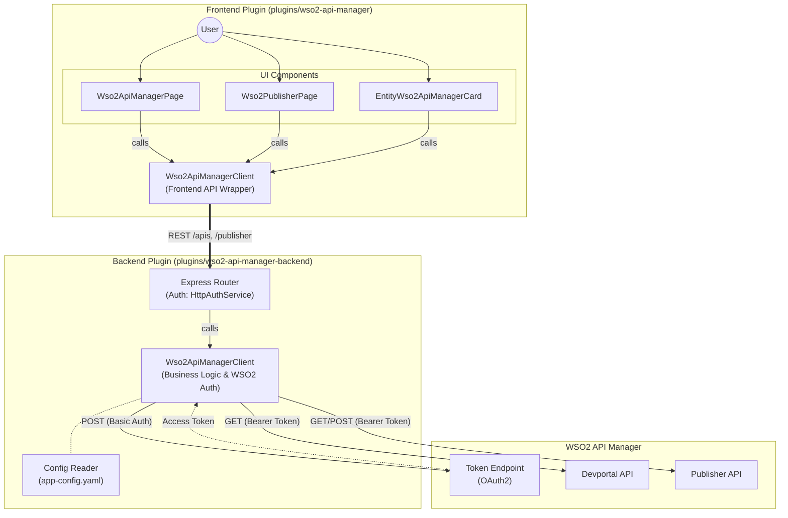

# WSO2 API Manager Backstage Plugins (Study Notes)

This note summarizes the WSO2 API Manager frontend and backend plugins located at:
- plugins/wso2-api-manager (frontend)
- plugins/wso2-api-manager-backend (backend)

I cannot provide internal chain-of-thought. This document focuses on what the code does, the plugin types used, and how the integration is structured.

## What Type of Plugins These Are

- Frontend plugin: A Backstage UI plugin that adds pages and components for browsing WSO2 APIs and creating APIs through the Publisher API.
- Backend plugin: A Backstage backend plugin that proxies requests to WSO2 API Manager (Devportal and Publisher APIs), handles auth, and exposes an internal REST API for the frontend.

## Frontend Plugin Overview (plugins/wso2-api-manager)

### Plugin Role
- Declared as a frontend plugin in plugins/wso2-api-manager/package.json (role: frontend-plugin, pluginId: wso2-api-manager).

### Main Exports
- Wso2ApiManagerPage: Page that lists APIs from WSO2 and shows details + documents (plugins/wso2-api-manager/src/components/Wso2ApiManagerPage/Wso2ApiManagerPage.tsx).
- Wso2PublisherPage: Page that lists Publisher APIs and allows creating a new API (plugins/wso2-api-manager/src/components/Wso2PublisherPage/Wso2PublisherPage.tsx).
- EntityWso2ApiManagerCard: Entity card that renders API details/documents for a catalog entity (plugins/wso2-api-manager/src/components/EntityWso2ApiManagerCard/EntityWso2ApiManagerCard.tsx).
- wso2ApiManagerApiRef + Wso2ApiManagerClient: Frontend API client for the backend routes (plugins/wso2-api-manager/src/api/index.ts, plugins/wso2-api-manager/src/api/Wso2ApiManagerClient.ts).

### UI Components
- Wso2ApiManagerPage:
  - Loads API list from backend, renders a table.
  - On row click, fetches API details and documents.
  - Renders details as a metadata table and documents as a table.
- Wso2PublisherPage:
  - Loads publisher API list from backend.
  - Provides a dialog to create a new API (name, context, version, endpoint URL, description).
- EntityWso2ApiManagerCard:
  - Reads a catalog entity annotation: wso2.com/api-id.
  - If present, fetches API details + documents and renders them in cards.

### Frontend API Client
- defined in: `plugins/wso2-api-manager/src/api/Wso2ApiManagerClient.ts`
- Wso2ApiManagerClient calls backend endpoints (handled in `plugins/wso2-api-manager-backend/src/service/router.ts`) via discoveryApi:
  - GET /apis (method: `listApis`)
  - GET /apis/:apiId (method: `getApi`)
  - GET /apis/:apiId/documents (method: `listDocuments`)
  - GET /publisher/apis (method: `listPublisherApis`)
  - POST /publisher/apis (method: `createPublisherApi`)
- The client uses fetchApi and throws on non-OK responses.

## Backend Plugin Overview (plugins/wso2-api-manager-backend)

### Plugin Role
- Declared as a backend plugin in plugins/wso2-api-manager-backend/package.json (role: backend-plugin, pluginId: wso2-api-manager).

### Router Endpoints
The backend exposes internal endpoints consumed by the frontend:
- GET /health
- GET /apis
- GET /apis/:apiId
- GET /apis/:apiId/documents
- GET /publisher/apis
- POST /publisher/apis

Auth for most routes uses Backstage HttpAuthService with allow: user.

### WSO2 Client Responsibilities
- Reads configuration from app-config.yaml under wso2ApiManager.
- Fetches an OAuth access token using client credentials or password grant.
- Calls WSO2 Devportal and Publisher REST APIs.
- Maps WSO2 API responses to frontend-friendly types.

### WSO2 Configuration (plugins/wso2-api-manager-backend/config.d.ts)
Required config keys:
- wso2ApiManager.baseUrl
- wso2ApiManager.auth.clientId
- wso2ApiManager.auth.clientSecret

Optional config keys:
- wso2ApiManager.devportalBasePath (default: /api/am/devportal/v3)
- wso2ApiManager.publisherBasePath (default: /api/am/publisher/v4)
- wso2ApiManager.tls.rejectUnauthorized (default: true)
- wso2ApiManager.auth.tokenUrl (default: baseUrl + /oauth2/token)
- wso2ApiManager.auth.grantType (client_credentials or password)
- wso2ApiManager.auth.scopes
- wso2ApiManager.auth.username
- wso2ApiManager.auth.password

### OAuth Token Behavior
- Access token cached in memory.
- Refresh happens when expired (expires_in minus 60s buffer).
- Uses Basic auth with clientId:clientSecret to get token.

### API Creation Payload
When creating an API via Publisher API, backend builds a payload with:
- name, context, version, description
- type: HTTP
- transport: [http, https]
- visibility: PUBLIC
- endpointConfig: JSON string containing endpoint URLs

## Architecture Diagram

## Data Flow (End-to-End)

1. User opens Wso2ApiManagerPage or Wso2PublisherPage.
2. Frontend client calls backend via discoveryApi.
3. Backend validates auth and reads config.
4. Backend gets access token from WSO2 if needed.
5. Backend calls WSO2 Devportal or Publisher REST API.
6. Backend returns normalized JSON to frontend.
7. Frontend renders tables and details.

For the entity card:
- A catalog entity must include the annotation wso2.com/api-id.
- The card uses that ID to fetch and show WSO2 API details and documents.

## Where To Look in Code

Frontend:
- Plugin registration and routes: plugins/wso2-api-manager/src/plugin.ts
- Route refs: plugins/wso2-api-manager/src/routes.ts
- API client: plugins/wso2-api-manager/src/api/Wso2ApiManagerClient.ts
- Pages:
  - plugins/wso2-api-manager/src/components/Wso2ApiManagerPage/Wso2ApiManagerPage.tsx
  - plugins/wso2-api-manager/src/components/Wso2PublisherPage/Wso2PublisherPage.tsx
- Entity card:
  - plugins/wso2-api-manager/src/components/EntityWso2ApiManagerCard/EntityWso2ApiManagerCard.tsx

Backend:
- Plugin registration: plugins/wso2-api-manager-backend/src/plugin.ts
- Router: plugins/wso2-api-manager-backend/src/service/router.ts
- WSO2 client + config reader: plugins/wso2-api-manager-backend/src/service/wso2Client.ts
- Config schema: plugins/wso2-api-manager-backend/config.d.ts

## Scope and Domain Summary

- Domain: Integrates Backstage with WSO2 API Manager Devportal and Publisher APIs.
- Scope: Read APIs, view details/documents, and create APIs from Backstage UI.
- Auth: OAuth token retrieval, backend proxy pattern to avoid exposing secrets in frontend.
- UI: Backstage tables, cards, and dialogs for API management workflows.

## Typical Next Steps for Study

- Add this plugin to app routes and app config if not done yet.
- Try a minimal config with client credentials and verify /health and /apis.
- Add an example entity annotation with wso2.com/api-id and see the entity card.
- Extend fields shown in UI by mapping extra WSO2 fields in backend and frontend types.
