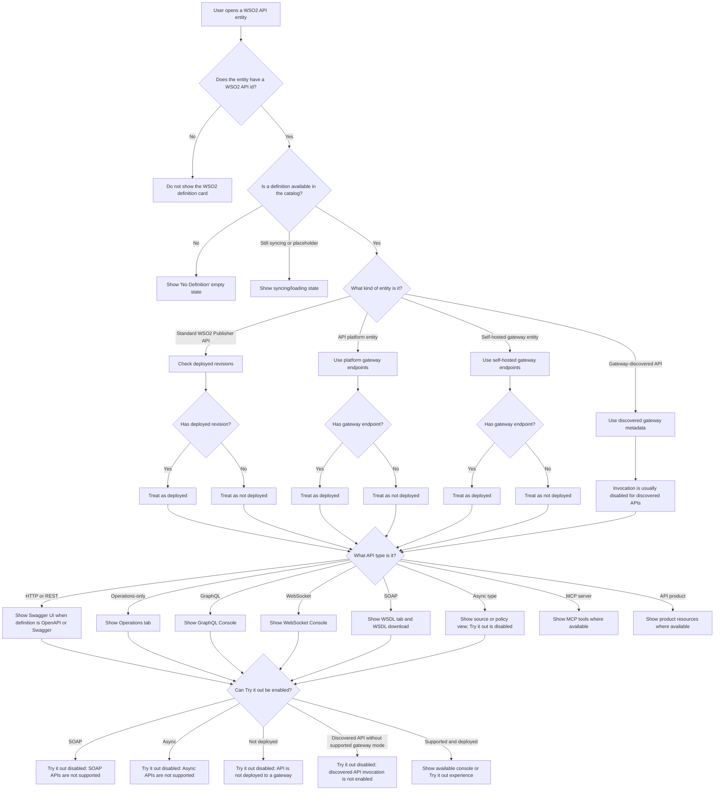
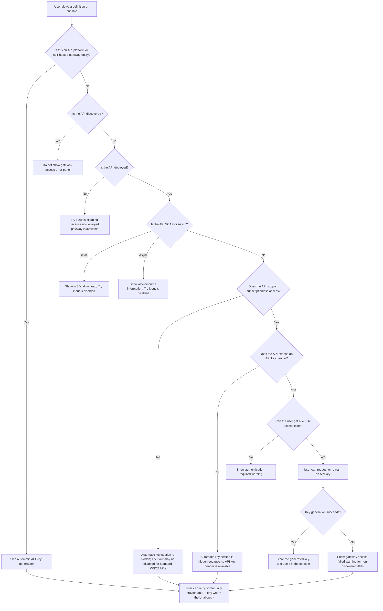

# Visual Decision Guide

This page explains how the WSO2 UI decides what a user sees for an API entity.

The goal is to describe the behavior without requiring users to understand source code, backend routes, hooks, or catalog internals.

## Recommended Visualization

Use both:

- A decision tree for conditional behavior.
- A feature matrix for quick comparison.

The decision tree is best when explaining why a tab, console, or API key section appears or does not appear. The matrix is best when users want to quickly compare HTTP, SOAP, GraphQL, WebSocket, discovered APIs, API products, MCP servers, and services.

## API Definition Decision Tree

## API Key and Invocation Decision Tree

## Tab Selection Summary

| Condition | User-facing result |
| --- | --- |
| Missing WSO2 API id | WSO2 definition card does not render. |
| Definition is missing | Empty state says no definition is available. |
| Definition is still syncing or placeholder | Loading state says it is syncing with WSO2 Gateway. |
| API type is `GRAPHQL` | GraphQL Console tab is selected. |
| API type is `WS` | WebSocket Console tab is selected. |
| API type is `SOAP` | WSDL tab is available. |
| Definition has operations but no OpenAPI or Swagger document | Operations tab is shown. |
| Definition is OpenAPI or Swagger | Swagger UI is shown. |
| Policies or operations are available | Policies tab is shown. |
| Source view is available | View Source tab is shown. |

## Feature Availability Matrix

| API or entity type | Main view | Invocation behavior | API key behavior | Download behavior |
| --- | --- | --- | --- | --- |
| HTTP or REST API | Swagger UI | Enabled only when deployed and supported by policy/header conditions | Automatic key section can appear for deployed, non-discovered, subscriptionless APIs with API key header support | Documents if available |
| GraphQL API | GraphQL Console | Can use gateway URLs when deployed | Same key conditions as supported standard APIs | Documents if available |
| WebSocket API | WebSocket Console | Can use gateway URLs when deployed | Same key conditions as supported standard APIs | Documents if available |
| SOAP API | WSDL tab | Try it out disabled | Automatic key flow is not the main path | WSDL download and documents if available |
| Async API | Source or policy-oriented view | Try it out disabled | Automatic key flow is not the main path | Documents if available |
| Operations-only API | Operations tab | Console can be built from operations when available | Same key conditions as supported standard APIs | Documents if available |
| API platform entity | Definition and gateway endpoints | Deployment is inferred from gateway endpoints | Automatic key generation is skipped | Documents if available |
| Self-hosted gateway entity | Definition and gateway endpoints | Deployment is inferred from gateway endpoints | Automatic key generation is skipped | Documents if available |
| Gateway-discovered API | Discovered metadata and definition if present | Invocation is usually disabled | Gateway access error panel is hidden | Documents if available |
| API product | Product resources | No direct product-level invocation documented for users | Not applicable in current user flow | Not applicable |
| MCP server | MCP tools | No standard API invocation flow | Not applicable in current user flow | Documents if available |
| Service Catalog service | Service details, usage, and definition | No API console flow | Not applicable | Service definition download |

## User-Friendly Wording

When documenting this behavior for users, prefer:

- "If the API is deployed..."
- "If WSO2 provides an OpenAPI definition..."
- "If the API supports API-key access..."
- "If the API was discovered from a gateway..."
- "If invocation is not supported for this API type..."

Avoid source-level terms such as component names, hook names, backend route names, and internal variable names in user-facing docs.
